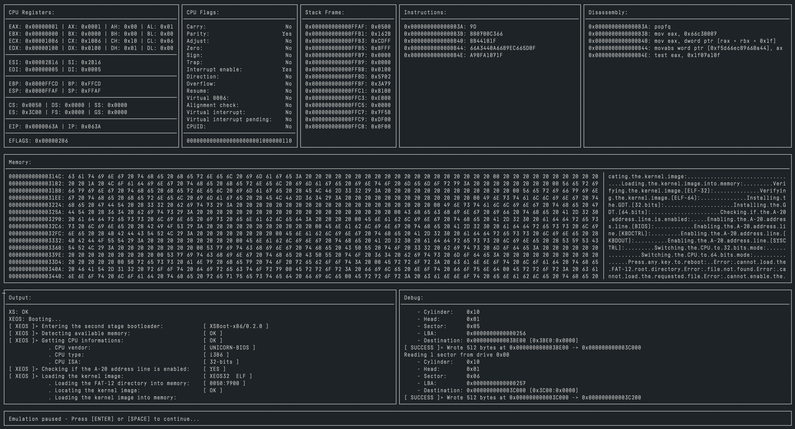

unicorn-bios
============

  

About
-----

Basic BIOS emulator for Unicorn Engine.

### Usage:

    Usage: unicorn-bios [OPTIONS] BOOT_IMG
    
    Options:
        
        --help   / -h:  Displays help.
        --memory / -m:  The amount of memory to allocate for the virtual machine
                        (in megabytes). Defaults to 64.
        --break-int:    Breaks on interrupt calls.
        --break-iret:   Breaks on interrupt returns.
        --debug-video:  Turns on debug output for video services.
        --single-step:  Breaks on every instruction.

### Installation:

    brew install --HEAD macmade/tap/unicorn-bios

License
-------

unicorn-bios is released under the terms of the MIT license.

Repository Infos
----------------

    Owner:          Jean-David Gadina - XS-Labs
    Web:            www.xs-labs.com
    Blog:           www.noxeos.com
    Twitter:        @macmade
    GitHub:         github.com/macmade
    LinkedIn:       ch.linkedin.com/in/macmade/
    StackOverflow:  stackoverflow.com/users/182676/macmade
